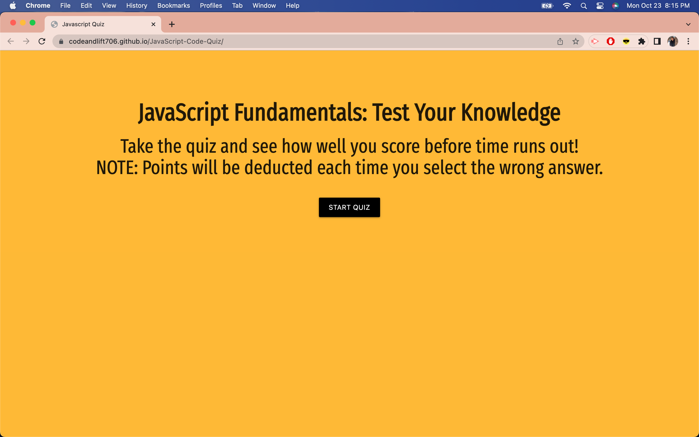
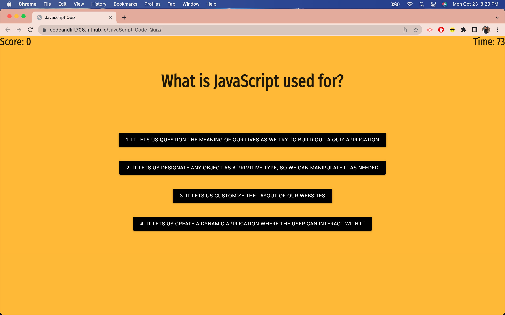
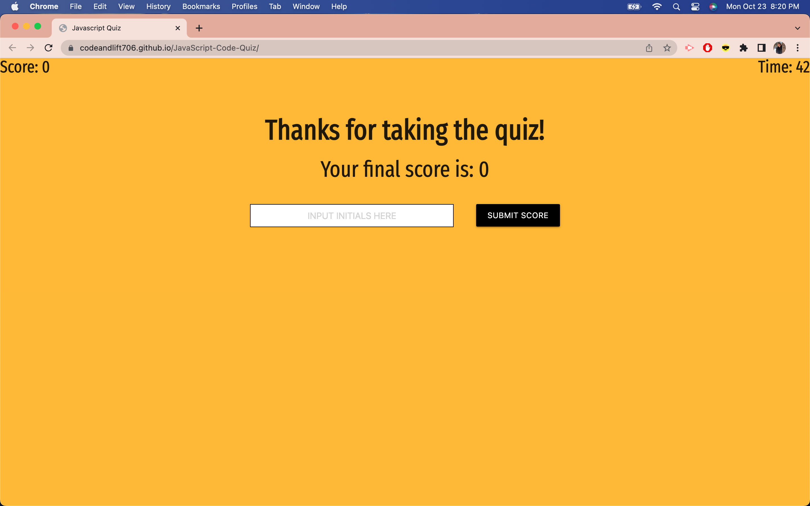
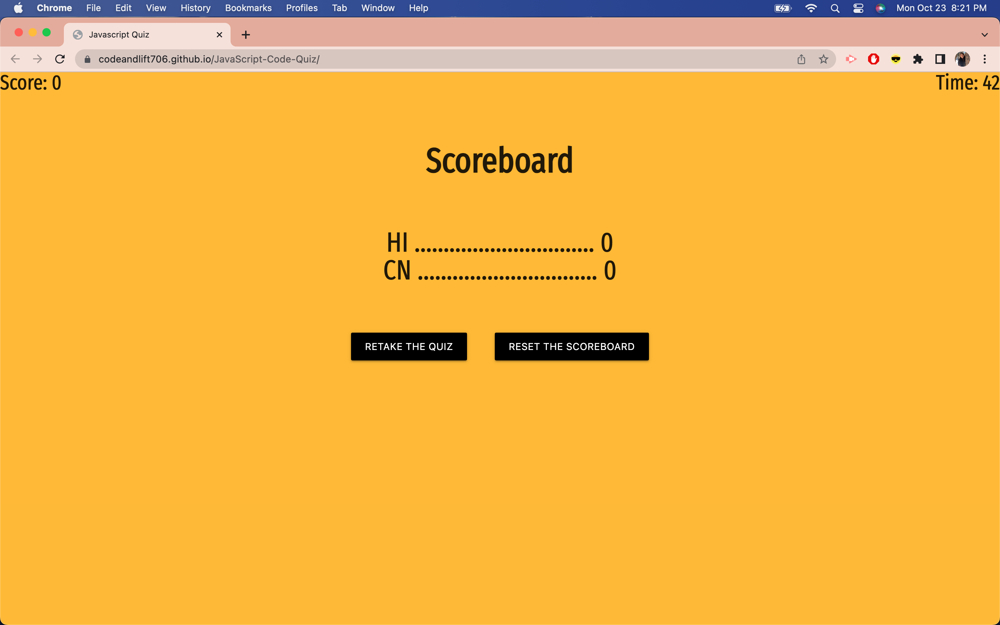

# JavaScript Code Quiz

## Table of Contents
- [Description](#description)
- [Installation](#installation)
- [Usage](#usage)
- [License](#license)
- [Contribution](#contribution)
- [Questions](#questions)

## Description
The purpose of creating a timed quiz through the browser is to use this as a future resource to review JavaScript fundamentals. This application was created with HTML, CSS, and JavaScript. On click, users will answer a series of questions and try to gain as many points before the timer runs out or before the end of the quiz. Points will be deducted if the user selects the wrong answer. When the timer is over, users can see their final score and submit their score and initials to the scoreboard. The deployed application can be found here: https://codeandlift706.github.io/JavaScript-Code-Quiz/.

## Installation
VS Code to create and manipulate HTML, CSS, and JavaScript for the application through the web browser. GitHub for version control and web page deployment.

## Usage
This can be used as a quiz template for any subject.

View a screenshot of the homepage with the start quiz button:

View a screenshot of the question page to select an answer:

View a screenshot of the end of the quiz to input initials to submit score:

View a screenshot of the scoreboard with the retake quiz button and reset scoreboard button:

## License
This project is under the MIT license.

## Contribution
The coding (event listeners, arrays, for loops, functions, timer, conditional statements, local storage, etc) -all the additions- that were made to the web page are credited to the curriculum taught in the UCI coding boot camp. I also received assistance ASKBCS Assistant for the stringify/parse methods.
The CSS Reset Sheet code can be obtained here: https://meyerweb.com/eric/tools/css/reset/. 
The CDN links for CSS Framework, Materialize, can be found here: https://materializecss.com/getting-started.html. 
I got the font family from this resource: https://fonts.google.com/specimen/Fira+Sans+Extra+Condensed.
How I aligned text can be found here: https://css-tricks.com/almanac/properties/t/text-align/#:~:text=The%20text%2Dalign%20property%20in,aligns%20along%20the%20left%20side.
How I used flexbox properties for CSS: https://css-tricks.com/snippets/css/a-guide-to-flexbox/.
This is the resource I used to prevent the answer buttons from displaying inline: https://stackoverflow.com/questions/42723596/prevent-flex-items-from-rendering-side-to-side.
This is the source I use to retrieve the Lakers hex code colors for the theme: https://teamcolorcodes.com/los-angeles-lakers-color-codes/.
How I used local storage can be found here: https://blog.logrocket.com/localstorage-javascript-complete-guide/.
How I cleared local storage is from this resource: https://theanshuman.dev/articles/the-right-way-to-use-localstorage-in-javascript-41a0.
The source for information on addEventListener: https://www.w3schools.com/js/js_htmldom_eventlistener.asp.
The source for the input type for button: https://developer.mozilla.org/en-US/docs/Web/HTML/Element/input/button.
How to toggle between hide and show: https://www.w3schools.com/howto/howto_js_toggle_hide_show.asp.
The source for querySelectorAll: https://developer.mozilla.org/en-US/docs/Web/API/Document/querySelectorAll.
To complete the README with screenshots, the source for the code is: https://stackoverflow.com/questions/10189356/how-to-add-screenshot-to-readmes-in-github-repository. 
To complete the README section, the source is: https://www.makeareadme.com/. 

## Questions
The link to my Github Profile here: https://github.com/codeandlift706.
For any additional questions, please reach me at: channguyen715@gmail.com.

