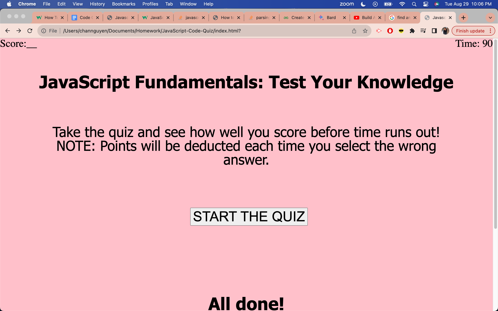
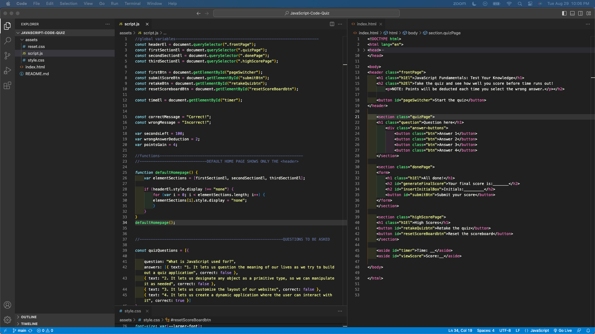

# JavaScript Code Quiz
The purpose of creating a timed quiz through the browser is to not only demonstrate my skills and knowledge on JavaScript to construct the application, but to also use this quiz as a future resource to review JavaScript fundamentals. This application was created with HTML, CSS, and JavaScript. The content of the page has a start button, a timer, and questions on the screen. When the timer is over, the user will see what score they received after answering the questions on the screen. The deployed application can be found here: https://codeandlift706.github.io/JavaScript-Code-Quiz/.

## Installation
VS Code to create and manipulate HTML, CSS, and JavaScript for the application through the web browser. GitHub for version control and web page deployment.

## Visuals
View a screenshot of the application here:

View a screenshot of the VS Code here:

## Credits
The CSS Reset Sheet code can be obtained here: https://meyerweb.com/eric/tools/css/reset/. 

How I aligned text can be found here: https://css-tricks.com/almanac/properties/t/text-align/#:~:text=The%20text%2Dalign%20property%20in,aligns%20along%20the%20left%20side.

To complete the README with screenshots, the source for the code is: https://stackoverflow.com/questions/10189356/how-to-add-screenshot-to-readmes-in-github-repository. To complete the README section, the source is: https://www.makeareadme.com/. 

The coding (EventListeners, arrays, for loops, functions, etc) -all the additions- that were made to the web page are credited to the curriculum taught in the UCI coding boot camp and are credited to the instructor and classmates in the UCI coding boot camp
Source for information on addEventListener: https://www.w3schools.com/js/js_htmldom_eventlistener.asp.

Input type for button: https://developer.mozilla.org/en-US/docs/Web/HTML/Element/input/button.
How to toggle between hide and show: https://www.w3schools.com/howto/howto_js_toggle_hide_show.asp.

I used this for querySelectorAll: https://developer.mozilla.org/en-US/docs/Web/API/Document/querySelectorAll.

I used the following resource to try to code my quiz: https://www.geeksforgeeks.org/how-to-create-a-simple-javascript-quiz/.
I also reference this video as a resource to try to code my quiz: https://www.youtube.com/watch?v=riDzcEQbX6k&ab_channel=WebDevSimplified.

